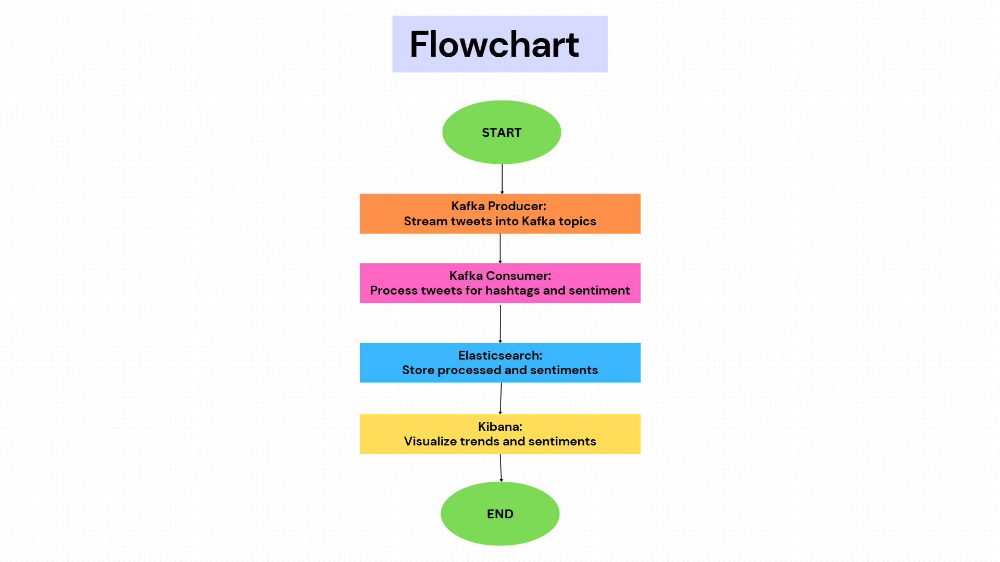

# Twitter Stream Processing Pipeline


## Overview
The **Twitter Stream Processing Pipeline** is a robust system designed to handle streaming tweets, process and transform the data, and visualize insights through an interactive web application. This pipeline integrates real-time data ingestion, processing, and storage while leveraging Kafka, Elasticsearch, and Kibana.

### Key Features:
1. **Stream Ingestion:** Simulates the Twitter API to stream tweets into Kafka topics.
2. **Data Processing:** Extracts hashtags, performs sentiment analysis, and formats tweets for storage.
3. **Storage:** Indexes processed tweets in Elasticsearch for efficient querying and visualization.
4. **Web Visualization:** Provides a dashboard to analyze trends, sentiments, and geo-coordinates.

---
## Requirements

- **Scala Version:** 2.12.18
- **Kafka Version:** Compatible with Apache Kafka
- **Elasticsearch Version:** 8.x
- **Kibana Version:** 8.x
- **Python Version:** 3.8+
- **Libraries:**
  - **TextBlock** (for text processing and analysis)
  - Sentiment analysis packages
---
## Installation Steps

1. **Clone the Repository:**
 ```bash
git clone https://github.com/your-repo/twitter-stream-pipeline.git
cd twitter-stream-pipeline
```
**Set Up Kafka:**
   - Download and install Apache Kafka.
   - Start the Zookeeper server:
```bash
bin/zookeeper-server-start.bat config/zookeeper.properties 
  ```
- Start the Kafka server:
 ```bash
bin/kafka-server-start.bat config/server.properties
```
- Create the tweets topic with 3 partitions:
 ```bash
bin/kafka-topics.bat --create --topic tweets --bootstrap-server localhost:9092 --partitions 3 --replication-factor 1
```
3. **Set Up Elasticsearch and Kibana:**
- Download and install Elasticsearch and Kibana.
- Start Elasticsearch:
```bash
./bin/elasticsearch
 ```
- Start Kibana:
```bash
./bin/kibana
```
4. **Run the Scala Application:**
    - Compile and run the project using SBT:
```bash
sbt compile
sbt run
 ```
---

## Running the Pipeline

### 1. Kafka Producer
Stream tweets into Kafka:
 ```bash
sbt runMain streaming.TweetProducer
 ```
### 2. Kafka Consumer
Process tweets from Kafka:
```bash
sbt runMain streaming.TweetConsumer
 ```
### 3. Elasticsearch Indexing
Index processed tweets into Elasticsearch:
```bash
sbt runMain storage.ElasticsearchClient
 ```
---
## Pipeline Overview

Below is a figure illustrating the pipeline:



### Pipeline Components:
1. **Kafka Producer:** Streams tweets to Kafka topics.
2. **Kafka Consumer:** Processes tweets (hashtags, sentiment analysis).
3. **Elasticsearch:** Stores processed tweets for search and analytics.
4. **Kibana Dashboard:** Visualizes trends, sentiments, and geo-data.

---

## Contributors
- **Raghad:** Kafka Producer/Consumer
- **Renad:** Tweet Processing and Sentiment Analysis
- **Hala:** Elasticsearch Integration and Kibana

